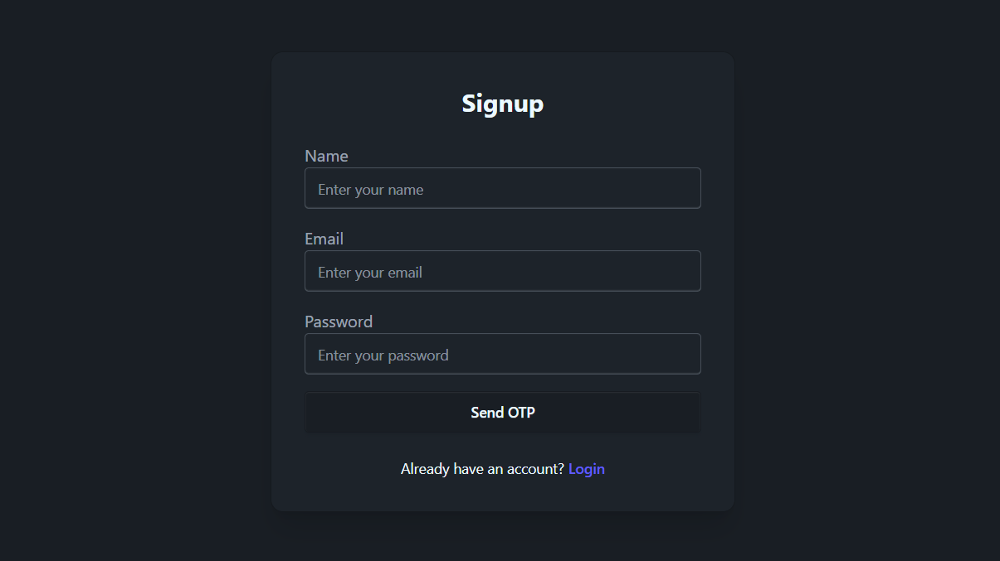
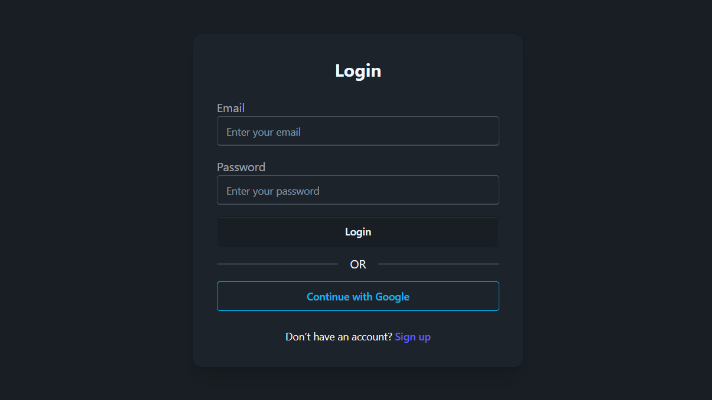
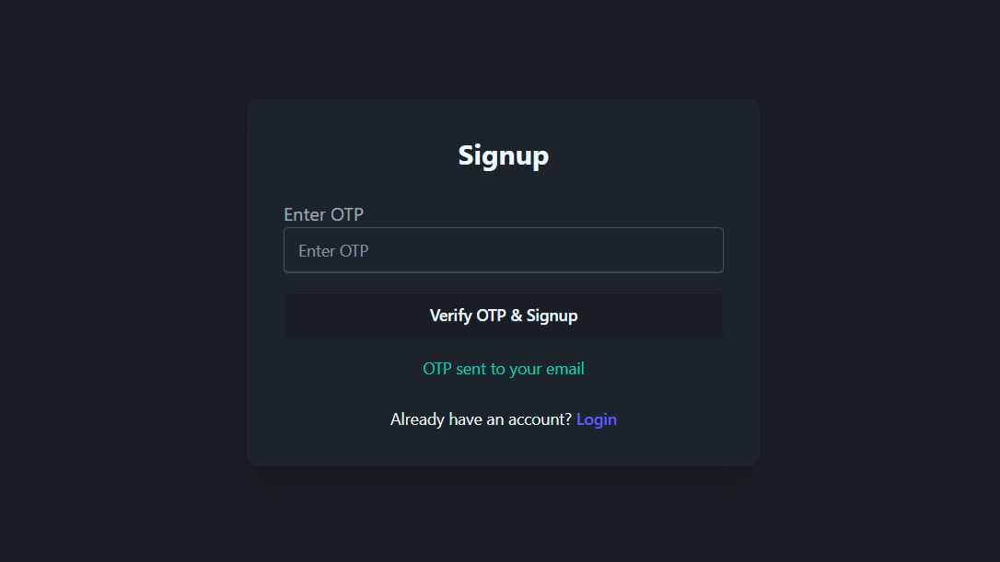
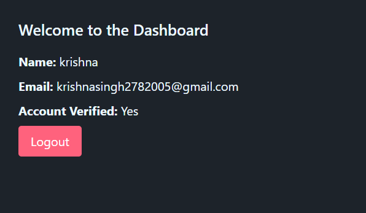

# Project Name: Login and Signup System

## Table of Contents
- [Project Name: Login and Signup System](#project-name-login-and-signup-system)
  - [Table of Contents](#table-of-contents)
  - [ScreenShots](#screenshots)
    - [Signup Page](#signup-page)
    - [Login Page](#login-page)
    - [OTP Verification Screen](#otp-verification-screen)
    - [Dashboard](#dashboard)
  - [Project Overview](#project-overview)
  - [Features](#features)
  - [Installation](#installation)
    - [Prerequisites](#prerequisites)
    - [Steps](#steps)
  - [Usage](#usage)
  - [**API Endpoints**](#api-endpoints)
    - [**1. Send OTP**](#1-send-otp)
    - [**2. Verify OTP \& Signup**](#2-verify-otp--signup)
    - [**3. Login**](#3-login)
    - [**4. Google Login**](#4-google-login)
  - [Contributing](#contributing)

---
## ScreenShots
### Signup Page


### Login Page


### OTP Verification Screen


### Dashboard



## Project Overview
This is a full-stack project that provides a simple login and signup system. The system is divided into two main components:

1. **Frontend**: A React-based web application for user interaction.
2. **Backend**: A Node.js and Express-based API for handling authentication and user data storage usign MongoDB.

---

## Features
- JWT-based authentication to secure API endpoints and enable user session management.
- Google auth for quick signup and login.
- Otp verification for added security.
- User signup and login functionality.
- Secure password hashing with bcrypt.
- Form validation and error handling.
- Responsive user interface.

---

## Installation
### Prerequisites
- Node.js and npm installed on your system.
- MongoDB instance running locally or in the cloud.

### Steps
1. Clone the repository:
   ```bash
   git clone https://github.com/krishnasinghcode/Login-and-Signup-System.git
   cd Login-and-Signup-System
   ```

2. Install dependencies for both frontend and backend:
   ```bash
   cd backend
   npm install
   cd ../frontend
   npm install
   ```

3. Set up environment variables for the backend (see [Backend README](./backend/README.md) for details).

4. Start the backend server:
   ```bash
   cd backend
   npm start
   ```

5. Start the frontend development server:
   ```bash
   cd ../frontend
   npm run dev
   ```

---

## Usage
1. Open your browser and navigate to `http://localhost:5173` to access the frontend.
2. Use the signup page to create a new user account.
3. Log in using the registered credentials.
4. Interact with the application to test its functionality.


Here’s a **professional API documentation** tailored to your Login/Signup app based on the code you shared.
I’ll structure it in a **developer-friendly** format with request/response details, status codes, and usage examples.

---

Got it — you just want a **simple, basic API doc** listing the URLs, HTTP methods, and required data for login/signup.

Here’s the clean version:

---

## **API Endpoints**

### **1. Send OTP**

* **URL:** `/send-otp`
* **Method:** `POST`
* **Data Required:**

  ```json
  {
    "email": "user@example.com"
  }
  ```
* **Purpose:** Sends OTP to the given email for signup verification.

---

### **2. Verify OTP & Signup**

* **URL:** `/verify-signup`
* **Method:** `POST`
* **Data Required:**

  ```json
  {
    "name": "John Doe",
    "email": "user@example.com",
    "password": "securePassword123",
    "otp": "123456"
  }
  ```
* **Purpose:** Verifies OTP and creates a new user account.

---

### **3. Login**

* **URL:** `/login`
* **Method:** `POST`
* **Data Required:**

  ```json
  {
    "email": "user@example.com",
    "password": "securePassword123"
  }
  ```
* **Purpose:** Authenticates user and returns an access token.

---

### **4. Google Login**

* **URL:** `/auth/google`
* **Method:** `POST`
* **Data Required:**

  ```json
  {
    "token": "<GOOGLE_ID_TOKEN>"
  }
  ```
* **Purpose:** Authenticates via Google OAuth and returns an access token.

---

## Contributing
We welcome contributions to improve this project. Here’s how you can contribute:

1. Fork the repository.
2. Create a new branch:
   ```bash
   git checkout -b feature-name
   ```
3. Commit your changes:
   ```bash
   git commit -m "Add a new feature"
   ```
4. Push to your branch:
   ```bash
   git push origin feature-name
   ```
5. Submit a pull request.

---
